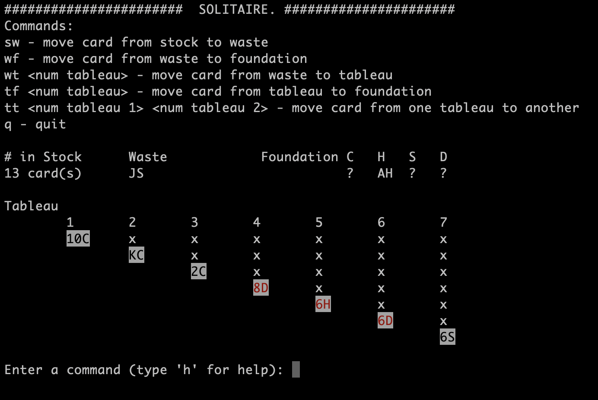

# Console-Based Solitaire
## How to Run 
- *Important note: Terminal must be in full screen in order for game to run*
- Run `python solitaire/`in the terminal once you navigate to the correct folder
- The following commands are valid for use 
	- `sw` - move card from stock to waste
	- `wf` - move card from waste to foundation
	- `wt <num tableau>` - move card from waste to tableau 
	- `tf <num tableau>` - move card from tableau to foundation
	- `tt <num tableau 1> <num tableau 2>` - move card from one tableau to another
	- `q` - quit the game

## External Libraries
- import `curses` to handle terminal independently for painting text on the screen, allowed for updating the parts of the screen for better game experience
- import `random` for shuffling deck

## System Design Decisions
- `Card` class
- `Deck` class
- `Solitaire` which has the following fields, each of which are classes 
themselves
	- `Tableau` used two hashmaps flipped and unflipped to store their respective cards at each column
	- `Foundation` used one hashmap to store the cards grouped by their suits
	- `StockWaste` used two arrays to store two piles of cards. 
 
